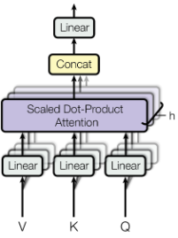
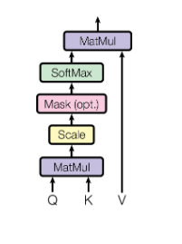
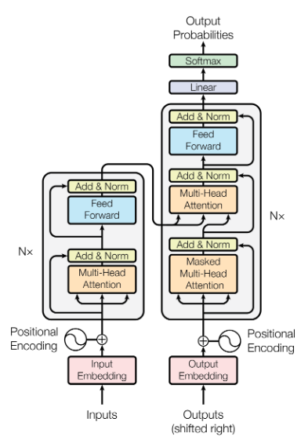
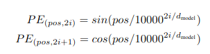

# TransformerPureC-
Implementation of Transformer in C++ from scratch

[Attention Is All You Need](https://arxiv.org/abs/1706.03762) presented a game-changing approach to solving natural language processing tasks.

In this paper a [Multihead Attention](https://github.com/a3a256/TransformerPureC-/blob/main/include/mha.h?plain=1#L45) layer was described as the following:
 

 </img>
 

 [Scaled Dot-Product attention](https://github.com/a3a256/TransformerPureC-/blob/main/include/mha.h?plain=1#L102) has the following design:

 

 </img>
 

 Such discovery was applied to the task of NLP and the following structure named [Transformer](https://github.com/a3a256/TransformerPureC-/blob/main/include/transformer.h?plain=1#L200) was built:

 

 </img>
 

 * [Embedding layer](https://github.com/a3a256/TransformerPureC-/blob/main/include/embedding.h) was implemented as one-hot encoded Embedding layer multiplied by weight matrix
 * [Positional encoding](https://github.com/a3a256/TransformerPureC-/blob/main/include/position_encoding.h) has the following formulation of cosine and sine formulations of different frequencies:

 

 </img>
 

 * [Encoder](https://github.com/a3a256/TransformerPureC-/blob/main/include/transformer.h?plain=1#L120) and [Decoder](https://github.com/a3a256/TransformerPureC-/blob/main/include/transformer.h?plain=1#L156) both consist of multiple [Encoder and Decoder Layers](https://github.com/a3a256/TransformerPureC-/blob/main/include/transformer.h?plain=1#L67) respectively.

 * Each decoder and encoder layer consists of Multihead Attention layer, addition followed by [Normalisation Layer](https://github.com/a3a256/TransformerPureC-/blob/main/include/normalisation.h) and [FeedForwardNetwork](https://github.com/a3a256/TransformerPureC-/blob/main/include/transformer.h?plain=1#L38) that has 2 [Linear Layers](https://github.com/a3a256/TransformerPureC-/blob/main/include/mha.h?plain=1#L11)

 In the implementation layers have random, but not learnable parameters.